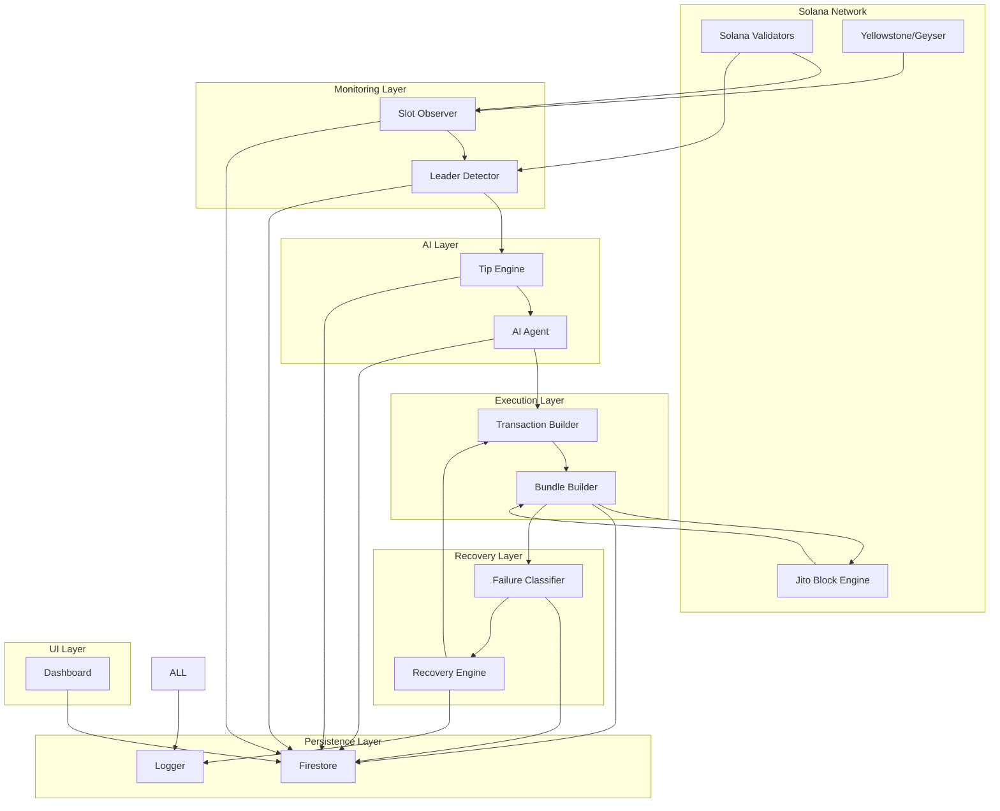
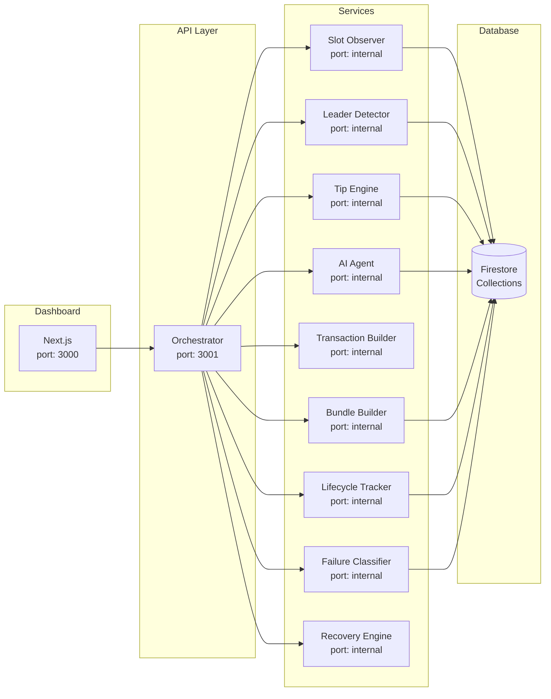
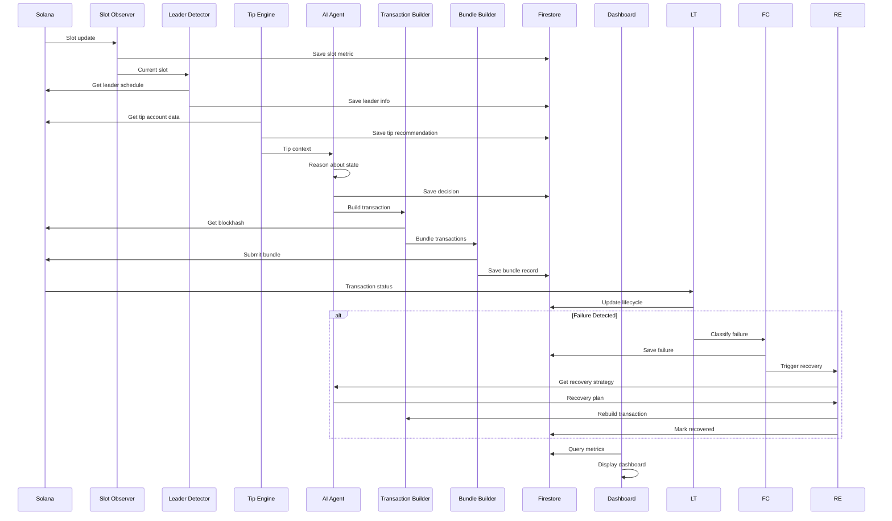
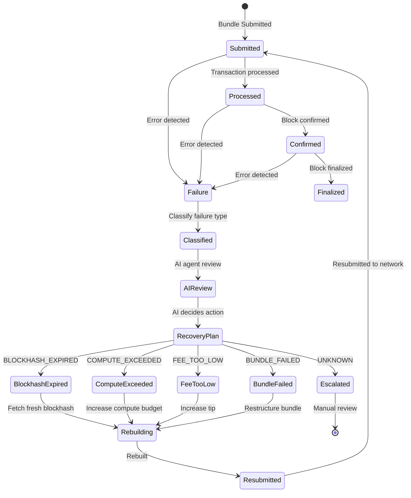
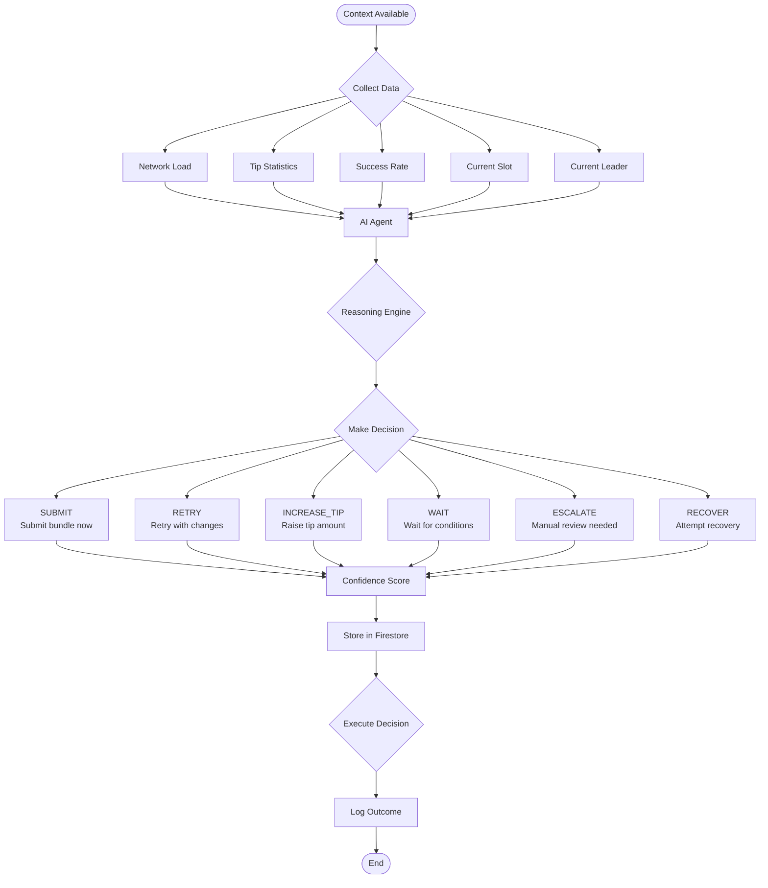
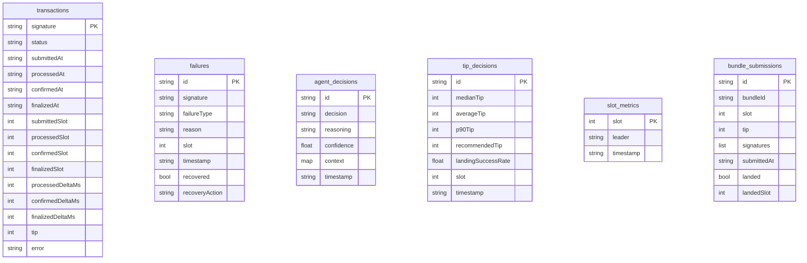

# Smart Transaction Stack - Architecture

## High-Level Architecture

## Component Diagram

## Data Flow Diagram

## Failure Handling Flow

## AI Decision Flow

## Firestore Collections

## Service Dependencies

| Service | Depends On | Provides |
|---------|------------|----------|
| Slot Observer | Solana RPC, Yellowstone gRPC | Real-time slot updates |
| Leader Detector | Slot Observer | Current/next leader info |
| Tip Engine | Solana RPC | Dynamic tip recommendations |
| AI Agent | Tip Engine, Firestore | Operational decisions |
| Transaction Builder | AI Agent | Signed transactions |
| Bundle Builder | Transaction Builder | Jito bundles |
| Lifecycle Tracker | Solana RPC/WS | Transaction state tracking |
| Failure Classifier | Lifecycle Tracker | Failure categorization |
| Recovery Engine | Failure Classifier, AI Agent | Automated recovery |
| Orchestrator | All Services | API, coordination |
| Dashboard | Orchestrator API | UI visualization |
